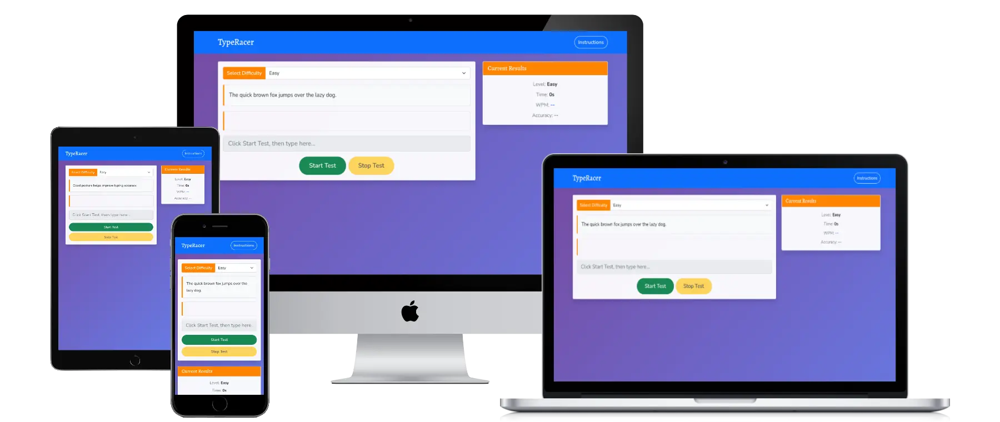

# TypeRacer - User Stories

## Project Overview

**Goal**: To provide a tool for users to improve their typing speed and accuracy  
**Target Users**: Anyone eager to enhance their typing skills  
**Key Features**: Easy interface, instant feedback, progress tracking, responsive design

---

## Epic 1: Core Typing Functionality

### US001: Start Typing Test

**As a** user  
**I want to** easily start a typing test  
**So that** I can quickly begin practicing my typing skills

**Acceptance Criteria:**

- [x] Clear "Start Test" button is prominently displayed
- [x] Instructions are visible before starting
- [x] Test begins immediately when button is clicked
- [x] Interface transitions smoothly to test mode

**Tasks:**

- [x] Create start button component
- [x] Add click event handler
- [x] Implement interface state management
- [x] Add loading/transition effects

**Priority:** Must Have  
**Story Points:** 3

---

### US002: Type Text with Real-time Feedback

**As a** user  
**I want to** see real-time feedback while typing  
**So that** I can correct mistakes immediately and learn faster

**Acceptance Criteria:**

- [x] Correct characters are highlighted in green
- [x] Incorrect characters are highlighted in red
- [x] Pending characters are shown in neutral color
- [x] Feedback updates instantly as user types
- [x] Visual feedback is clear and accessible

**Tasks:**

- [x] Implement character-by-character comparison
- [x] Add CSS classes for feedback states
- [x] Create real-time update mechanism
- [x] Ensure accessibility with ARIA labels

**Priority:** Must Have  
**Story Points:** 5

---

### US003: View Performance Metrics

**As a** user  
**I want to** see my typing speed (WPM) and accuracy  
**So that** I can track my performance and improvement

**Acceptance Criteria:**

- [x] WPM is calculated and displayed after test completion
- [x] Accuracy percentage is shown
- [x] Metrics are clearly visible and easy to understand
- [x] Results appear immediately after test ends

**Tasks:**

- [x] Implement WPM calculation algorithm
- [x] Implement accuracy calculation
- [x] Create results display component
- [x] Add proper formatting for metrics

**Priority:** Must Have  
**Story Points:** 3

---

## Epic 2: Difficulty and Content Management

### US004: Select Difficulty Levels

**As a** user  
**I want to** choose different difficulty levels  
**So that** I can practice at an appropriate level for my skill

**Acceptance Criteria:**

- [x] Easy, Medium, and Hard difficulty options available
- [x] Different text passages for each level
- [x] Clear indication of current difficulty
- [x] Ability to change difficulty between tests

**Tasks:**

- [x] Create difficulty selector component
- [x] Implement passage pools for each level
- [x] Add difficulty-based text selection
- [x] Style difficulty selector appropriately

**Priority:** Should Have  
**Story Points:** 3

---

### US005: Practice with Varied Content

**As a** user  
**I want to** type different passages each time  
**So that** I don't memorize content and get genuine practice

**Acceptance Criteria:**

- [x] Random passage selection from difficulty pool
- [x] Sufficient variety in content for each level
- [x] Passages are appropriate length for typing practice
- [x] Content is engaging and relevant

**Tasks:**

- [x] Create content pools for each difficulty
- [x] Implement random selection algorithm
- [x] Ensure content variety and quality
- [x] Add more passages over time

**Priority:** Should Have  
**Story Points:** 2

---

## Epic 3: Progress Tracking and Gamification

### US006: Track Best Performance

**As a** user  
**I want to** see my best WPM score  
**So that** I can track my improvement over time

**Acceptance Criteria:**

- [x] Best WPM score is saved locally
- [x] Best score is displayed prominently
- [x] Score updates when new record is achieved
- [x] Celebratory message for new records

**Tasks:**

- [x] Implement localStorage for score persistence
- [x] Create best score display component
- [x] Add score comparison logic
- [x] Style best score indicator

**Priority:** Should Have  
**Story Points:** 2

---

### US007: Retry Tests

**As a** user  
**I want to** easily retry a test  
**So that** I can practice the same content or try to improve my score

**Acceptance Criteria:**

- [x] "Retry" button appears after test completion
- [x] Clicking retry resets the current test
- [x] Previous results are cleared
- [x] Focus returns to input field

**Tasks:**

- [x] Create retry button component
- [x] Implement test reset functionality
- [x] Clear previous state and results
- [x] Restore focus to input

**Priority:** Should Have  
**Story Points:** 2

---

## Epic 4: Accessibility and User Experience

### US008: Accessible Interface

**As a** user with accessibility needs  
**I want to** use the app with assistive technology  
**So that** I can improve my typing skills regardless of my abilities

**Acceptance Criteria:**

- [x] Screen reader compatible
- [x] Keyboard navigation support
- [x] ARIA labels for all interactive elements
- [x] High contrast and readable fonts
- [x] Semantic HTML structure

**Tasks:**

- [x] Add ARIA labels and live regions
- [x] Implement keyboard navigation
- [x] Test with screen readers
- [x] Ensure semantic HTML structure

**Priority:** Must Have  
**Story Points:** 4

---

### US009: Responsive Design

**As a** user  
**I want to** use the app on any device  
**So that** I can practice typing on desktop, tablet, or mobile

**Acceptance Criteria:**

- [x] App works on desktop screens (1024px+)
- [x] App works on tablets (768px-1023px)
- [x] App works on mobile devices (320px-767px)
- [x] Touch-friendly interface on mobile
- [x] Content is readable at all screen sizes

**Tasks:**

- [x] Implement responsive CSS breakpoints
- [x] Test on multiple device sizes
- [x] Optimize touch interactions for mobile
- [x] Ensure readability across devices

**Priority:** Must Have  
**Story Points:** 4

---

## Epic 5: Enhanced Features

### US010: Educational Hints

**As a** user  
**I want to** receive helpful tips about language rules  
**So that** I can learn proper spelling and grammar while typing

**Acceptance Criteria:**

- [x] Context-sensitive hints appear when relevant
- [x] Tips are educational and helpful
- [x] Hints don't interfere with typing flow
- [x] Option to dismiss or hide hints

**Tasks:**

- [x] Implement context detection (e.g., practice/practise)
- [x] Create hint display system
- [x] Add educational content for common issues
- [x] Style hints appropriately

**Priority:** Could Have  
**Story Points:** 3

---

### US011: Timer Display

**As a** user  
**I want to** see how long I've been typing  
**So that** I can understand my pacing and endurance

**Acceptance Criteria:**

- [x] Timer starts when first character is typed
- [x] Timer updates in real-time during test
- [x] Timer stops when test completes
- [x] Time is displayed in clear format

**Tasks:**

- [x] Implement timer functionality
- [x] Start timer on first keystroke
- [x] Update timer display every second
- [x] Stop timer on test completion

**Priority:** Should Have  
**Story Points:** 2

---

---

## Epic 6: Enhanced User Experience (Challenge Implementation)

### US012: Auto-Start on Typing

**As a** user  
**I want to** have the test start automatically when I begin typing  
**So that** I can have a more seamless testing experience without clicking buttons

**Acceptance Criteria:**

- [ ] Test starts automatically when user types first character
- [ ] No need to click "Start Test" button
- [ ] Start button can be removed from interface
- [ ] Timer begins when first keystroke is detected
- [ ] Sample text is displayed before typing begins

**Tasks:**

- [ ] Remove start button functionality
- [ ] Implement auto-start on first keystroke
- [ ] Update UI to remove start button
- [ ] Update placeholder text to reflect new behavior

**Priority:** Must Have  
**Story Points:** 3  
**Status:** In Progress

---

### US013: Auto-Stop on Enter Key

**As a** user  
**I want to** complete the test by pressing Enter  
**So that** I have a natural way to finish without needing to click a button

**Acceptance Criteria:**

- [ ] Test stops when user presses Enter key
- [ ] Stop button can be removed from interface  
- [ ] Results are calculated and displayed immediately
- [ ] Input field is disabled after Enter press
- [ ] Works regardless of whether full text is typed

**Tasks:**

- [ ] Add Enter key event listener
- [ ] Remove stop button functionality
- [ ] Update UI to remove stop button
- [ ] Implement immediate result calculation on Enter

**Priority:** Must Have  
**Story Points:** 2  
**Status:** In Progress

---

### US014: Enhanced Retry Functionality

**As a** user  
**I want to** retry with enhanced functionality  
**So that** I can practice effectively with new content at the same difficulty

**Acceptance Criteria:**

- [ ] Retry button loads a new sentence of same difficulty
- [ ] Input textarea is cleared and re-enabled
- [ ] Results area is reset to initial state
- [ ] Retry button is disabled during active test
- [ ] Retry button appears only after test completion

**Tasks:**

- [ ] Enhance existing retry function to load new sentences
- [ ] Implement proper state management for retry button
- [ ] Clear and reset all test state on retry
- [ ] Add proper button enable/disable logic

**Priority:** Should Have  
**Story Points:** 3  
**Status:** In Progress

---

### US015: Enhanced Instructions Modal

**As a** user  
**I want to** access clear instructions via a modal  
**So that** I understand how to use the updated test interface

**Acceptance Criteria:**

- [x] Bootstrap modal opens when Instructions button is clicked
- [ ] Instructions reflect new auto-start and Enter-to-finish behavior
- [ ] Modal contains comprehensive usage information
- [ ] Modal is accessible and follows Bootstrap patterns

**Tasks:**

- [x] Modal structure already implemented
- [ ] Update modal content for new functionality
- [ ] Ensure modal follows accessibility best practices
- [ ] Test modal functionality across devices

**Priority:** Should Have  
**Story Points:** 1  
**Status:** In Progress

---

## Definition of Done

For each user story to be considered complete:

- [x] All acceptance criteria are met
- [x] Code is tested and working
- [x] Responsive design is verified
- [x] Accessibility requirements are met
- [x] Code is documented and clean
- [x] Feature works across major browsers

## Labels

- **Priority**: Must Have, Should Have, Could Have, Won't Have
- **Component**: UI, Logic, Data, Accessibility, Performance
- **Device**: Desktop, Tablet, Mobile
- **Browser**: Chrome, Firefox, Safari, Edge


